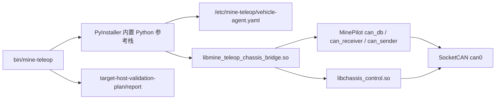

# Ubuntu Bundle 架构说明

本文说明 `bin/mine-teleop`、`libmine_teleop_chassis_bridge.so` 和 `libchassis_control.so` 的边界。

## 总体结构



## 执行文件层

`bin/mine-teleop` 是统一命令入口。它通过 `mine_teleop.cli` 把子命令分发到原有入口：

- `vehicle-agent/vehicle_agent.py`
- `vehicle-media-agent/vehicle_media_agent.py`
- `vehicle-uploader/vehicle_uploader.py`
- `driver-console/driver_console.py`
- `signaling-server/signaling_server.py`
- `scripts/*.py`

PyInstaller 会把这些脚本作为 data 放进单文件执行包，运行时解包到临时目录并由 `mine_teleop.cli` 调用。

## Python 参考栈层

`mine_teleop/` 内置在执行文件里，负责：

- 配置解析和安全门禁。
- 控制协议、状态机、超时制动和急停锁存。
- Mock/动态库 VehicleAdapter 工厂。
- 媒体 pipeline 规划和硬编验收报告。
- 录像分段、上传队列、Upload API 和验收指标。
- 本地信令、TURN/ICE 发放和审计。
- 目标主机验收脚本和归档报告。

## 动态库层

`libmine_teleop_chassis_bridge.so` 是稳定 C ABI 层，Python 侧通过 `ctypes` 加载。它的职责：

- 打开/关闭底层 ChassisControl。
- 把标准化控制命令映射到底盘控制状态。
- 调用 `EmergencyStopWheels()`。
- 通过 MinePilot `can_receiver`/`can_db` 拉取 decoded CAN feedback。
- 把 feedback 转成 Python 侧 telemetry snapshot。

`libchassis_control.so` 是底层控制库，当前来自 ChassisControl/MinePilot 集成基线。它实际负责底盘控制发送路径，并与 MinePilot CAN sender/receiver 共同工作。

## 配置层

`/etc/mine-teleop/vehicle-agent.yaml` 把执行文件和动态库连接起来：

```yaml
hardware:
  can:
    interface: can0
    bitrate: 500000
  encoding:
    vaapi_render_device: /dev/dri/renderD128
    dri_card_device: /dev/dri/card1
  network:
    interface: wwan0

field_safety:
  commissioning_mode: bench
  require_can_feedback_before_control: true

vehicle_adapter:
  type: can
  integration:
    chassis_control:
      abi: c_shim
      bridge_library_path: /opt/mine-teleop/lib/libmine_teleop_chassis_bridge.so
      library_path: /opt/mine-teleop/lib/libchassis_control.so
```

真实 adapter 配置还必须声明控制单位、档位、心跳、安全停车、急停能力和 telemetry 字段。非 `mock` adapter 必须提供控制超时标定证据。

配置层现在是现场变量的主入口：

- CAN 口和 adapter 绑定必须同时指向同一个 interface；配置加载器会拒绝不一致。
- VAAPI/DRI 节点和 GStreamer 插件会进入媒体探测和硬编验收计划。
- TURN/S3 凭据允许用文件路径配置，生效配置日志只记录 `configured`。
- `field_safety` 记录调试阶段、速度上限、CAN feedback、急停复位和时间同步门禁。

## 验收链路

目标主机验收不是只看进程能启动，而是要求证据闭环：

1. GPU/DRI/VAAPI 节点可见。
2. 车端配置 preflight 通过。
3. CAN interface 可见。
4. MinePilot CAN source/socket/send 探针通过。
5. ChassisControl bridge 检查和构建通过。
6. `vehicle-agent --adapter-status` 能打开真实 adapter。
7. `vehicle-agent --adapter-status --poll-feedback --require-feedback` 收到 decoded CAN feedback。
8. uploader service smoke 输出结构化 JSON。
9. 归档报告核对结果、附件和 evidence 字段。

这条链路由 `bin/mine-teleop target-host-validation-plan` 和
`bin/mine-teleop target-host-validation-report` 固化。

## 架构边界

当前 bundle 解决的是“Ubuntu 工控机可运行联调包”：

- 单入口：`bin/mine-teleop`
- 动态库：`libmine_teleop_chassis_bridge.so`、`libchassis_control.so`
- 配置：`/etc/mine-teleop/vehicle-agent.yaml`
- 验收：JSONL 结果和归档报告

它不替代现场安全流程，不替代真实驾驶端产品 UI，也不证明车辆已经能安全上路。安全上路仍取决于台架、封闭场地、急停、安全员和制动距离实测。
