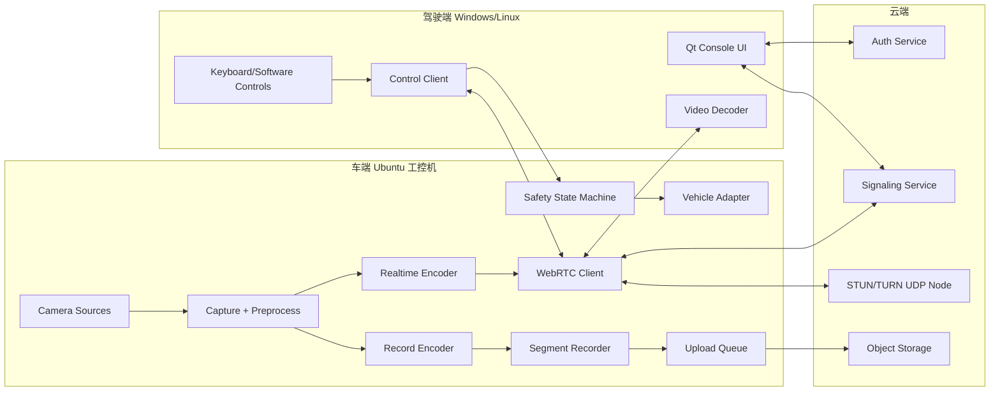

# 系统架构

## 总览

系统由四类组件组成：

- Vehicle Agent：运行在车端 Ubuntu 工控机。
- Driver Console：运行在远端模拟驾驶器 Windows/Linux。
- Cloud Control Plane：云端信令、鉴权、会话和上传协调服务。
- Realtime Relay：STUN/TURN 或后续 SFU/媒体中继节点。

## 关键链路

### 实时视频链路

1. Camera Source 采集原始帧。
2. Preprocess 分流：
   - 实时流：缩放到实时配置分辨率，例如 720p。
   - 录像流：保留采集原分辨率。
3. Realtime Encoder 使用低延迟编码参数生成 H.264。
4. WebRTC 通过 P2P 或 TURN UDP 发送到驾驶端。
5. 驾驶端解码并显示。

设计要求：

- 实时流使用短队列。
- 网络拥塞时优先丢旧帧。
- 允许动态调整码率、帧率或分辨率。
- 不允许上传任务影响实时编码线程。

### 控制链路

1. 驾驶端输入层产生控制状态。
2. Control Client 以 20 Hz 发送 `ControlCommand`。
3. 车端接收后校验序号、时间戳、会话和控制权。
4. Safety State Machine 判断是否可执行。
5. Vehicle Adapter 下发给真实车辆接口或 Mock Adapter。
6. Telemetry 回传当前状态。

设计要求：

- 控制命令轻量、固定频率、可追溯。
- 安全停车由车端本地状态机执行。
- 云端不在控制闭环中做逐帧/逐命令转发决策。

### 录像上传链路

1. Record Encoder 生成分段文件。
2. Segment Recorder 写入本地目录和元数据。
3. Upload Queue 根据策略挑选文件。
4. Uploader 打包或转码后上传对象存储。
5. 上传状态更新到本地索引。

设计要求：

- 上传低优先级。
- 支持断点重试。
- 支持限速。
- 支持磁盘水位保护。

## 进程划分建议

首版可以先采用较少进程，方便调试：

- `vehicle-agent`：车端主进程，包含采集、编码、WebRTC、控制、安全、录像、上传队列。
- `driver-console`：驾驶端 Qt 应用。
- `signaling-server`：云端信令和会话管理服务。
- `turn-server`：coturn 或等价 TURN 服务。

后续如果车端进程过大，可拆分：

- `vehicle-media-agent`
- `vehicle-control-agent`
- `vehicle-recorder`
- `vehicle-uploader`

拆分前提是接口稳定，且有监控和进程监管能力。

## 推荐技术栈

### 车端

- 语言：C++ 优先，Python 可用于工具脚本。
- 媒体：GStreamer + WebRTC 或 FFmpeg/LibAV 作为编码验证工具。
- 编码：Intel VAAPI/QSV 优先，x264 兜底。
- 配置：YAML 或 TOML。
- 日志：结构化日志，支持文件轮转。
- 运行：systemd 服务或容器。

### 驾驶端

- 语言：C++。
- UI：Qt。
- 媒体：GStreamer/Qt 集成或 WebRTC native。
- 输入：首版键盘/软件控件，后续 HID/方向盘适配。

### 云端

- 信令服务：Python FastAPI/WebSocket、Go 或 Node.js 均可。
- TURN：coturn。
- 存储：S3 兼容对象存储。
- 部署：独立实时节点建议开启 UDP，避免与其他业务争抢。

## 边界与依赖

车端不应依赖云端实时决策来保证安全。云端可以帮助连接、认证和审计，但车辆控制安全必须落在车端本地。

驾驶端不应直接绕过会话系统控制车辆。所有控制命令必须带有会话身份和控制权验证。

录像上传不属于实时控制路径。上传失败只能影响云端归档状态，不应影响视频预览和控制命令。

