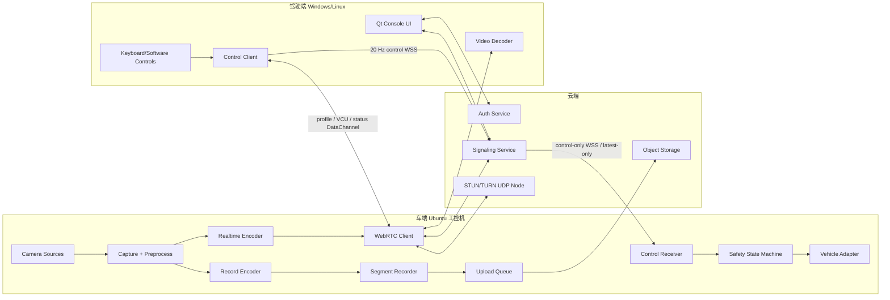

# 系统架构

## 总览

系统由四类组件组成：

- Vehicle Agent：运行在车端 Ubuntu 工控机。
- Driver Console：运行在远端模拟驾驶器 Windows/Linux。
- Cloud Control Plane：云端信令、鉴权、会话和上传协调服务。
- Realtime Relay：STUN/TURN 或后续 SFU/媒体中继节点。

```mermaid
flowchart LR
  subgraph Vehicle["车端 Ubuntu 工控机"]
    Cameras["Camera Sources"]
    Capture["Capture + Preprocess"]
    RealtimeEnc["Realtime Encoder"]
    RecordEnc["Record Encoder"]
    WebRTCClient["WebRTC Client"]
    ControlRx["Control Receiver"]
    VehicleAdapter["Vehicle Adapter"]
    Safety["Safety State Machine"]
    Recorder["Segment Recorder"]
    Uploader["Upload Queue"]
  end

  subgraph Cloud["云端"]
    Auth["Auth Service"]
    Signaling["Signaling Service"]
    Turn["STUN/TURN UDP Node"]
    Storage["Object Storage"]
  end

  subgraph Driver["驾驶端 Windows/Linux"]
    UI["Qt Console UI"]
    Decoder["Video Decoder"]
    Input["Keyboard/Software Controls"]
    ControlClient["Control Client"]
  end

  Cameras --> Capture
  Capture --> RealtimeEnc
  Capture --> RecordEnc
  RealtimeEnc --> WebRTCClient
  RecordEnc --> Recorder
  Recorder --> Uploader
  Uploader --> Storage
  WebRTCClient <--> Turn
  WebRTCClient <--> Decoder
  Input --> ControlClient
  ControlClient -->|"20 Hz control WSS"| Signaling
  Signaling -->|"control-only WSS / latest-only"| ControlRx
  ControlClient <-->|"profile / VCU / status DataChannel"| WebRTCClient
  ControlRx --> Safety
  Safety --> VehicleAdapter
  UI <--> Auth
  UI <--> Signaling
  WebRTCClient <--> Signaling
```

## 关键链路

### 实时视频链路

1. Camera Source 采集原始帧。
2. Preprocess 分流：
   - 实时流：缩放到实时配置分辨率，例如 720p。
   - 录像流：保留采集原分辨率。
3. Realtime Encoder 使用低延迟编码参数生成 H.264。
4. WebRTC 通过 P2P 或 TURN UDP 发送到驾驶端。
5. 驾驶端解码并显示。

设计要求：

- 实时流使用短队列。
- 网络拥塞时优先丢旧帧。
- 允许动态调整码率、帧率或分辨率。
- 不允许上传任务影响实时编码线程。

### 控制链路

1. 浏览器输入层只向本机回环 Control Client 提交最新输入意图，不负责控制发送定时，也不通过 WebRTC DataChannel 发送普通控制命令。
2. 原生 Control Client 管理输入租约，并由固定 20 Hz 线程生成包含 `protocol_version`、`seq` 和完整控制状态的 `ControlCommand`，通过独立控制 WSS 发送。
3. Signaling Service 按会话和车辆维护容量为 1 的 latest-only 控制 mailbox；新命令原子覆盖旧命令，TTL 为 150 ms，不进入可积压、可重放的通用信令队列。
4. 车端使用独立 control-only WSS 接收 mailbox，只处理最新且未过期的命令，并校验协议版本、序号、会话和控制权；另有独立 50 ms 看门狗线程，不受 WSS、媒体或网页等待影响。
5. Safety State Machine 判断是否可执行；输入租约过期后，只有转向/油门/制动精确归零的原生安全心跳可刷新链路看门狗，任何过期非零指令都严格丢弃。
6. Vehicle Adapter 下发给真实车辆接口或 Mock Adapter。
7. Telemetry 回传当前状态；WebRTC DataChannel 只保留 session profile、VCU handshake 和 status 交换。

页面失焦、隐藏或渲染线程冻结时，浏览器不能继续刷新输入租约。租约到期后，原生 20 Hz 线程仍持续发送保留挡位、转向/油门/制动归零且带“不新鲜输入”标记的包。车端只允许这种执行量精确归零的过期包作为原生链路安全心跳，严格丢弃任何过期非零指令；因此切到后台不会制造假断包，而原生进程或 WSS 真正断流仍会触发车端看门狗。恢复页面后必须先收到新的中性输入才能解除 interlock，旧油门状态不能自动恢复。

设计要求：

- 控制命令轻量、固定频率、可追溯。
- 安全停车由车端本地状态机执行。
- 急停命令一旦到达车端即锁存，不依赖驾驶端持续发送。
- 云端只做鉴权和有界的 latest-only 命令暂存/转发，不执行车辆控制或安全决策，也不允许旧命令积压重放。

### 录像上传链路

1. Record Encoder 生成分段文件。
2. Segment Recorder 写入本地目录和元数据。
3. Upload Queue 根据策略挑选文件。
4. Uploader 逐文件直传对象存储；默认不做 zip/tar 打包或二次转码。
5. 上传状态更新到本地索引。

设计要求：

- 上传低优先级。
- 支持断点重试。
- 支持限速。
- 支持磁盘水位保护。

## 进程划分建议

首版可以先采用较少进程，但安全关键逻辑不能和媒体编码 pipeline 共故障域：

- 当前 `vehicle-runtime` 由原生媒体进程建立 WebRTC 视频以及用于 profile/VCU/status 的 DataChannel，并由独立 control-only WSS 接收控制命令、独立 50 ms 线程推进看门狗；车端仍运行 Control Receiver、Safety State Machine 与 Vehicle Adapter，控制 WSS 失联和进程正常退出都会本地全停。
- 在接入真实 CAN 前，仍必须用进程强杀、媒体阻塞和底层控制器看门狗完成故障隔离验收；如果底层看门狗不能独立保证停车，再把安全执行拆为独立高优先级进程和有界本地 IPC。
- `vehicle-uploader`：低优先级上传进程或独立服务，负责上传队列、限速和重试。
- `mine-teleop-control`：跨平台 C++ 回环服务，使用系统浏览器呈现驾驶页面；浏览器提交最新输入意图，原生线程以 20 Hz 通过独立控制 WSS 发送命令。
- `signaling-server`：云端信令和会话管理服务。
- `turn-server`：coturn 或等价 TURN 服务。

如果第一阶段为了联调临时放在一个可执行文件内，至少也要把控制/安全放入独立高优先级线程、使用看门狗监测媒体线程卡死，并在设计上保留拆分到独立进程的 IPC 边界。

后续可继续拆分：

- `vehicle-recorder`

拆分前提是接口稳定，且有监控和进程监管能力。

## 推荐技术栈

### 车端

- 语言：C++ 优先，Python 可用于工具脚本。
- 媒体：GStreamer + WebRTC 或 FFmpeg/LibAV 作为编码验证工具。
- 编码：Intel VAAPI/QSV 优先，x264 兜底。
- 配置：YAML 或 TOML。
- 日志：结构化日志，支持文件轮转。
- 运行：systemd 服务或容器。

### 驾驶端

- 语言：C++。
- UI：Qt。
- 媒体：GStreamer/Qt 集成或 WebRTC native。
- 输入：首版键盘/软件控件，后续 HID/方向盘适配。

### 云端

- 信令服务：当前为独立 C++ HTTP/WebSocket 后端，回环监听并由 Caddy 在 443
  终止 TLS/WSS；单实例已有内存 delivery cursor、显式 ACK 和幂等发送确认，
  多实例化前仍需增加持久状态、共享游标与跨实例投递。
- TURN：coturn。
- 存储：S3 兼容对象存储。
- 部署：独立实时节点建议开启 UDP，避免与其他业务争抢。

## 边界与依赖

车端不应依赖云端实时决策来保证安全。云端可以帮助连接、认证和审计，但车辆控制安全必须落在车端本地。

驾驶端不应直接绕过会话系统控制车辆。所有控制命令必须带有会话身份和控制权验证。

录像上传不属于实时控制路径。上传失败只能影响云端归档状态，不应影响视频预览和控制命令。
